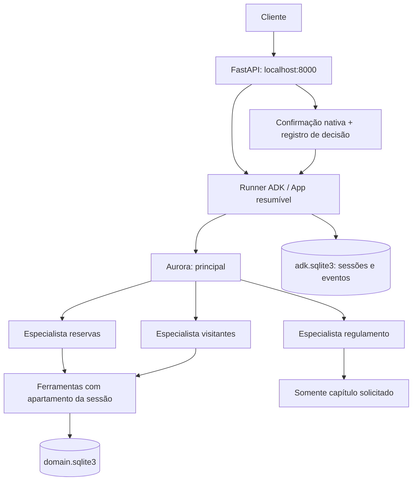

# Assistente Residencial Aurora

Desafio 309 do MBA em Engenharia de Software com IA. API local com Google ADK 2.9.2,
Gemini configurável e dados persistentes. O consentimento e as regras de negócio são
verificados em código. **Testes offline usam ADK real e modelo roteirizado somente nos testes;
a execução com Gemini real ainda não foi realizada.**

## Arquitetura



- [`src/aurora/agents.py`](src/aurora/agents.py), `build_app`: principal e três especialistas;
  leitura/escrita exclusivamente por ferramentas. `FunctionTool` exige confirmação conforme taxa
  da área ou sempre para visitantes. `App` habilita `ResumabilityConfig`.
- [`src/aurora/runtime.py`](src/aurora/runtime.py), `Runtime`: `DatabaseSessionService` e `Runner`;
  namespace `app_name=aurora`, `user_id=session_id`. Recompõe pendências dos eventos persistidos,
  não de uma lista em memória. A resposta de confirmação leva o ID nativo e a invocação original.
- [`src/aurora/store.py`](src/aurora/store.py), `Store`: banco de domínio com unidades, áreas,
  reservas, visitantes, vínculo imutável da sessão, decisões e operações idempotentes.
- [`src/aurora/api.py`](src/aurora/api.py): contrato HTTP e códigos 404/409; modelos de entrada
  recusam campos extras. `confirmado` aceita somente booleano.

| Método e rota | Corpo / resultado |
| --- | --- |
| `POST /sessoes` | `{ "apartamento": "101" }` → 201 `{ "session_id": "..." }` |
| `POST /sessoes/{id}/mensagens` | `{ "texto": "Reserve a quadra para 6 de abril de 2030" }` → 200 resposta |
| `POST /sessoes/{id}/confirmacoes` | `{ "id": "...", "confirmado": true }` → 200 resposta ou 409 |
| `GET /sessoes/{id}/eventos` | Lista integral de eventos ADK em ordem |
| `GET /apartamentos/{ap}/reservas` | `[{ "codigo": "...", "area": "...", "data": "..." }]` |
| `GET /apartamentos/{ap}/visitantes` | `[{ "nome": "...", "data": "..." }]` |

Resposta de conversa/decisão: `{ "resposta": "...", "confirmacoes_pendentes":
[{ "id": "...", "acao": "reservar_area", "detalhes": { "area": "salao-de-festas",
"data": "2030-04-20", "taxa": 150.0 } }] }`.
Sessão desconhecida retorna 404 em todas as suas rotas. Apartamento desconhecido na criação:422.
Os GETs por apartamento são endpoints locais de inspeção exigidos pelo exercício;
não são ferramentas dos agentes. Autenticação está fora do escopo.

## Garantias

| Garantia | Implementação | Evidência offline |
| --- | --- | --- |
| Consentimento só pela rota | `Runtime.confirm` confere pendência da sessão, registra decisão UNIQUE e envia `FunctionResponse(adk_request_confirmation)`; `permitted` exige confirmação nativa **e** decisão com sessão/chamada/argumentos iguais | `test_native_confirmation_restart_isolation`, `test_approved_flag_without_route_decision_cannot_write` |
| Isolamento de unidade | `apartment` consulta `Store.apartment(context.session.id)`; nenhuma ferramenta recebe apartamento como parâmetro; consultas/cancelamento filtram a unidade | `test_full_domain_journey_and_chapter`, `test_occupied_area_never_exposes_owner` |
| Persistência | Sessões/eventos no ADK SQLite, domínio no SQLite separado; pendências derivam do histórico | `test_actual_process_restart_with_pending_visitor`: encerra processo próprio, abre outro, compara eventos e aprova no especialista correto |
| Contexto do regulamento | `consultar_regulamento` escolhe um cabeçalho a partir do tópico; retorna apenas aquele capítulo; texto integral nunca entra nas instruções | Pergunta da piscina retorna capítulo IV / domingo até 20h; canários de capítulos alheios ausentes dos eventos |
| Exclusividade | Índice `UNIQUE(area,data) WHERE ativa=1` no INSERT; conflito é resultado normal `indisponivel` | Duas aprovações HTTP simultâneas: 200/200, um vencedor; também duas threads disputando SQLite |

Reservas gratuitas e cancelamentos próprios não exigem aprovação. Reservas pagas e visitantes
aguardam a decisão; texto “confirmo” não é resposta de sistema. Enquanto houver pendência, nova
mensagem apenas devolve essa pendência. IDs desconhecidos, alheios ou já respondidos retornam 409.
Códigos usam UUID; cancelamento é lógico, preservando o código histórico. Operações já aplicadas
são idempotentes por sessão/chamada. Disponibilidade nunca retorna unidade ou código de terceiros.

Limites operacionais: executar um processo/worker, como no comando abaixo. Os locks por sessão
são locais, enquanto a exclusividade das reservas reside no banco. Não há transação distribuída
entre os dois bancos nem garantia de conclusão após crash no meio de uma aprovação. A decisão
é consumida antes de retomar o Runner: se houver falha nesse intervalo, inspecione eventos e dados;
não reenvie a mesma confirmação esperando nova execução. Falhas de modelo propagam erro, nunca
sucesso fictício. A falta de configuração retorna 503 antes de consumir uma decisão.

As fontes públicas `dados/` estão intactas; [hashes](docs/upstream-integrity.json) são testados.
[`docs/validacao.md`](docs/validacao.md) detalha a cobertura e as pendências externas.
O SDD está em [`specs/001-assistente-aurora/`](specs/001-assistente-aurora/), governado pela
[constituição](.specify/memory/constitution.md). Spec Kit oficial 1.0.8.

Conceitos consultados no acervo local, sem publicar transcrições:
[Aprovando Execução de Tools](https://plataforma.fullcycle.com.br/courses/a091b0fe-a5c6-4287-a3d3-1ec61defcfd3/413/224/290/conteudos?capitulo=290&conteudo=18102),
[Idempotência](https://plataforma.fullcycle.com.br/courses/a091b0fe-a5c6-4287-a3d3-1ec61defcfd3/413/224/290/conteudos?capitulo=290&conteudo=18561),
[Limitação do Workflow com Tool Confirmation](https://plataforma.fullcycle.com.br/courses/a091b0fe-a5c6-4287-a3d3-1ec61defcfd3/413/224/290/conteudos?capitulo=290&conteudo=18578),
[Persistência da sessão no banco de dados](https://plataforma.fullcycle.com.br/courses/a091b0fe-a5c6-4287-a3d3-1ec61defcfd3/413/224/290/conteudos?capitulo=290&conteudo=18485).
A limitação descrita na aula foi tratada com teste na versão fixada, não presumida como resolvida.

## Como rodar

Requisitos: Python 3.12 ou 3.13 e [uv](https://docs.astral.sh/uv/). Na raiz do clone:

```bash
uv sync --frozen --no-editable
uv run --no-editable aurora restore
cp .env.example .env
# Edite .env localmente: GOOGLE_API_KEY e GEMINI_MODEL.
uv run --no-editable aurora start
```

O `--no-editable` também evita que o iCloud marque o `.pth` editável como oculto, o que faz
Python 3.12 ignorar o caminho do pacote. Após mudar código local, use
`uv sync --frozen --no-editable --reinstall-package assistente-residencial-aurora`.

`.env.example` contém somente nomes, sem valores. `.env` é ignorado. Escolha um modelo Gemini
habilitado em sua conta no [catálogo oficial](https://ai.google.dev/gemini-api/docs/models).
Nenhuma quota ou gratuidade é assumida; a aplicação pode fazer até 15 chamadas de modelo por
invocação. A chave é usada exclusivamente pelo SDK em execução local. Não há modelo falso em produção.

O servidor escuta exclusivamente `http://127.0.0.1:8000`; contrato interativo em `/docs`.
Exemplo de criação:

```bash
curl -s http://127.0.0.1:8000/sessoes -H 'Content-Type: application/json' \
  -d '{"apartamento":"101"}'
# Use o session_id retornado nas rotas de mensagens e confirmações.
```

**Restore:** pare o servidor antes. `aurora restore` recarrega os JSONs originais e remove também
sessões/eventos/decisões. Opera somente nos nomes fixos `domain.sqlite3` e `adk.sqlite3` e seus
journals dentro de `.runtime/aurora/`, após verificar o marcador `OWNER`. Recusa diretório não vazio
sem marcador e links simbólicos. Não recebe caminho de banco externo e não remove outros arquivos.

Testes, sem chave e sem rede de modelo:

```bash
uv run --no-editable pytest -q
```

Os testes de HTTP abrem apenas processos próprios em portas efêmeras e os encerram ao terminar.
As chamadas do modelo de teste são roteirizadas: comprovam código/ADK/SQL, não interpretação de
linguagem natural do Gemini. Rodar os 15 passos do avaliador com Gemini e registrar seus resultados
continua pendente de credenciais e execução real. Referências técnicas:
[confirmação nativa ADK](https://adk.dev/tools-custom/confirmation/),
[Google ADK no PyPI](https://pypi.org/project/google-adk/2.9.2/).
